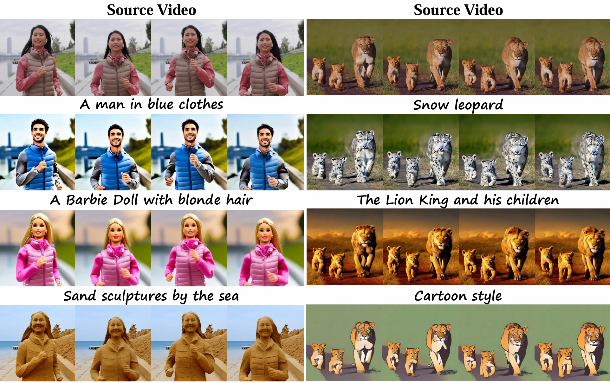
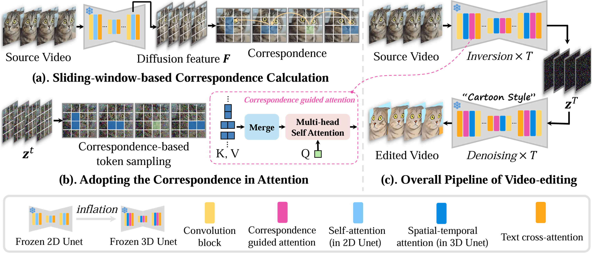
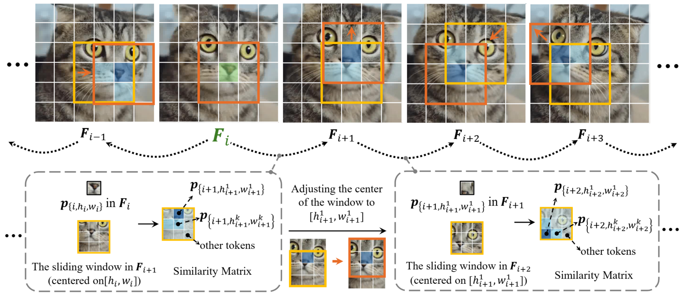

# COVE

This repository is the official Pytorch implementation for [COVE](https://arxiv.org/abs/2406.08850).

 [](https://cove-video.github.io/) [](https://arxiv.org/abs/2406.08850) 

> **COVE: Unleashing the Diffusion Feature Correspondence for Consistent Video Editing**  
> [Jiangshan Wang](https://scholar.google.com/citations?user=HoKoCv0AAAAJ&hl=en)\*,
> [Yue Ma](https://scholar.google.com/citations?user=kwBR1ygAAAAJ&hl=en&oi=ao)\*,
> [Jiayi Guo](https://scholar.google.com/citations?user=2p6GCEEAAAAJ&hl=en&oi=ao)\*,
> [Yicheng Xiao](https://scholar.google.com/citations?user=oakZP0cAAAAJ&hl=en&oi=ao),
> [Gao Huang](https://scholar.google.com/citations?user=-P9LwcgAAAAJ&hl=en&oi=ao),
> [Xiu Li](https://scholar.google.com/citations?user=Xrh1OIUAAAAJ&hl=en&oi=ao),


<p>


Video editing is an emerging task, in which most current methods adopt the pre-trained text-to-image (T2I) diffusion model to edit the source video in a zero-shot manner. Despite extensive efforts, maintaining the temporal consistency of edited videos remains challenging due to the lack of temporal constraints in the regular T2I diffusion model. To address this issue, we propose COrrespondence-guided Video Editing (COVE), leveraging the inherent diffusion feature correspondence to achieve high-quality and consistent video editing. Specifically, we propose an efficient sliding-window-based strategy to calculate the similarity among tokens in the diffusion features of source videos, identifying the tokens with high correspondence across frames. During the inversion and denoising process, we sample the tokens in noisy latent based on the correspondence and then perform self-attention within them. To save GPU memory usage and accelerate the editing process, we further introduce the temporal-dimensional token merging strategy, which can effectively reduce redundancy. COVE can be seamlessly integrated into the pre-trained T2I diffusion model without the need for extra training or optimization. Extensive experiment results demonstrate that COVE achieves the start-of-the-art performance in various video editing scenarios, outperforming existing methods both quantitatively and qualitatively.
</p>

## News
- [2024.6.13] Paper released!

## ToDo
- □ Release code


## Method
### Overview
<p>


We propose correspondence guided video editing. Given a source video, we firstly extract the diffusion feature for each frame and calculate the correspondence among the tokens across frames. During the inversion and denoising process, the tokens are sampled based on their correspondence relationship. Through the self-attention among the corresponded tokens across frames, the quality and temporal consistency of edited videos are both significantly enhanced.
</p>

### Sliding-window-based Strategy
<p>


We propose the efficient sliding-window-based strategy for calculating the correspondence relationship among tokens in the diffusion feature of the source video, which can greatly reduce the computational comlexity.
</p>


## Visualizations
### Editing Result
  

<p align="center">

</p>


### Comparing with Recent Start-of-the-art Methods

<p align="center">

</p>


## Citation

If you find our work helpful, please **star 🌟** this repo and **cite 📑** our paper. Thanks for your support!

```
@article{wang2024cove,
  title={COVE: Unleashing the Diffusion Feature Correspondence for Consistent Video Editing},
  author={Wang, Jiangshan and Ma, Yue and Guo, Jiayi and Xiao, Yicheng and Huang, Gao and Li, Xiu},
  journal={arXiv preprint arXiv:2406.08850},
  year={2024}
}
```


## Contact
wjs23 at mails dot tsinghua dot edu dot cn


